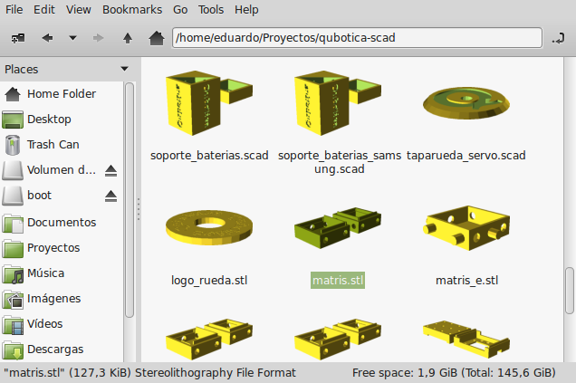

Miniaturas para 3D
==================

Resulta muy practico poder ver los archivos a imprimir, para esto diseñamos un pequeño programa.

Para instalarlo abrimos una terminal y ponermos:

~~~
wget https://github.com/maquinas-libres/openscad-thumbnailer/archive/master.zip
unzip master.zip
cd openscad-thumbnailer-master
sudo cp openscad-thumbnailer /usr/local/bin/
sudo cp openscad.thumbnailer /usr/share/thumbnailers/
~~~

Ahora tenemos que reiniciar pcmanfm y listo:

~~~
killall pcmanfm
pcmanfm
~~~

* Basado en https://wiki.archlinux.org/index.php/PCManFM#Tips_and_tricks
